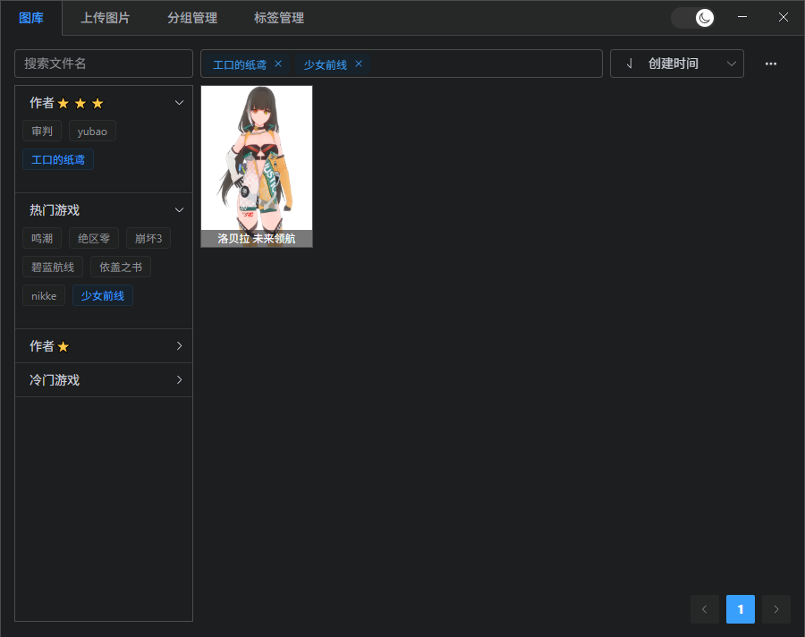

# HaremDB

_你的恋活人物卡管理器，让你从此不再烦恼_

受够了关键时刻在文件夹里翻来覆去找卡片？立刻使用 HaremDB 接管你的后宫，体验更加现代化的卡片管理方式！

> 内测中，暂未开放

  

> **本项目仅仅提供本地存储管理功能，不支持任何卡片云端存储与分享！**

## 更新计划

- [ ] 任意页面拖拽文件时，跳转到上传页面
- [ ] 拖拽zipmod文件到备注时，记录zipmod信息，并将其添加到游戏mod目录
- [ ] 删除卡片时如果记录了zipmod信息，提问是否一起删除
- [ ] 软件设置页面
- [ ] 软件关于页面

## 更新日志

### v0.0.2

#### 新功能

- [x] 夜间模式

#### 修复

- [ ] 进行重命名时，文本输入框没有内边距
- [ ] 分组名成重复检测行为异常
- [ ] 分组管理默认按用户定义排序
- [ ] 画廊页文件搜索应该是模糊搜索

#### 改进

- [ ] 在画廊页编辑卡片信息完成后关闭弹框
- [ ] 分组管理默认按用户定义排序

### v0.0.1

#### 修复

- [x] 当未分组没有数据时依旧会显示
- [x] 添加图片时不会自动生成未创建的标签
- [x] 添加标签后标签管理表格中分组选择器显示失效
- [x] 数据库中存储的图片位置依旧是原始地址，非仓库文件地址
- [x] 进行图片删除操作后，文件仓库未进行删除
