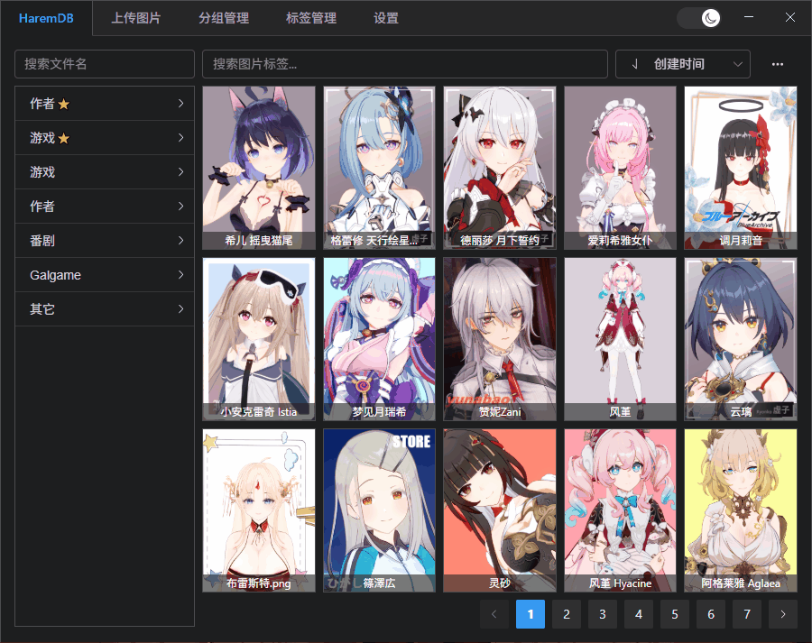

# HaremDB

受够了关键时刻在文件夹里翻来覆去找卡片？立刻使用 HaremDB 接管你的后宫，体验更加现代化的卡片管理方式！

> **本项目仅仅提供本地存储管理功能，不支持任何卡片云端存储与传播！**

**存储说明:
导入的人物卡程序会复制一份副本在程序目录下的 repo 文件夹中
导入的zipmod会复制一份到游戏目录下的 mods/haremdb 文件夹中，如果文件已存在会静默失败**

## 更新计划

- [x] 卡片记录拖拽次数，添加按拖拽次数排序
- [x] 按文件夹组织方式批量导入与自动打标
- [ ] 添加游戏入口与打开文件夹功能

## 优化建议

- [x] 主页标签搜索给予键入建议
- [ ] 加大程序宽度，确保主页标签侧栏能够容纳足够多的标签

### 当前版本BUG

请前往issue页使用中文反馈

<!-- 个人迁移进度 E:\Koikatu\[DATA]\card\虚子\崩 -->
